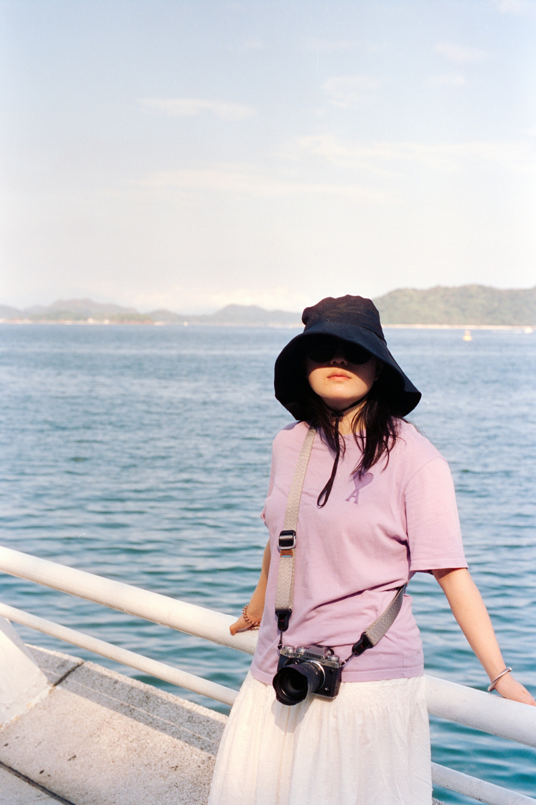
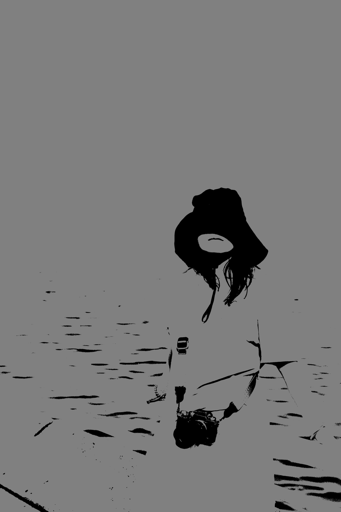
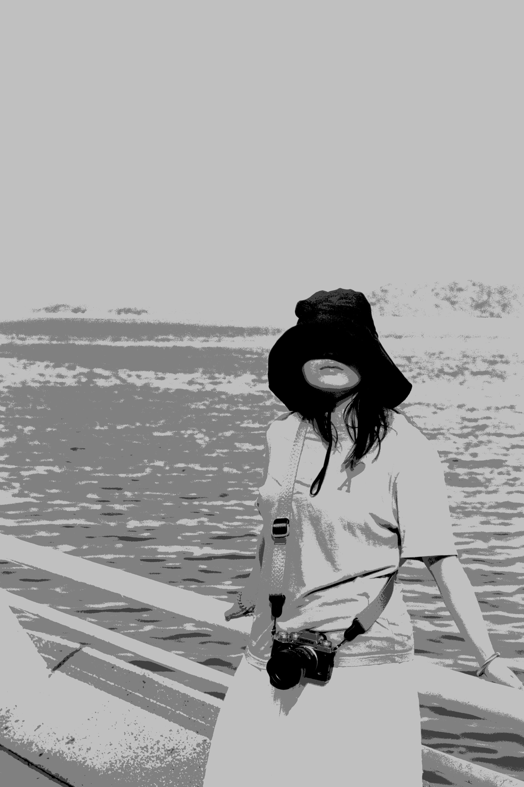
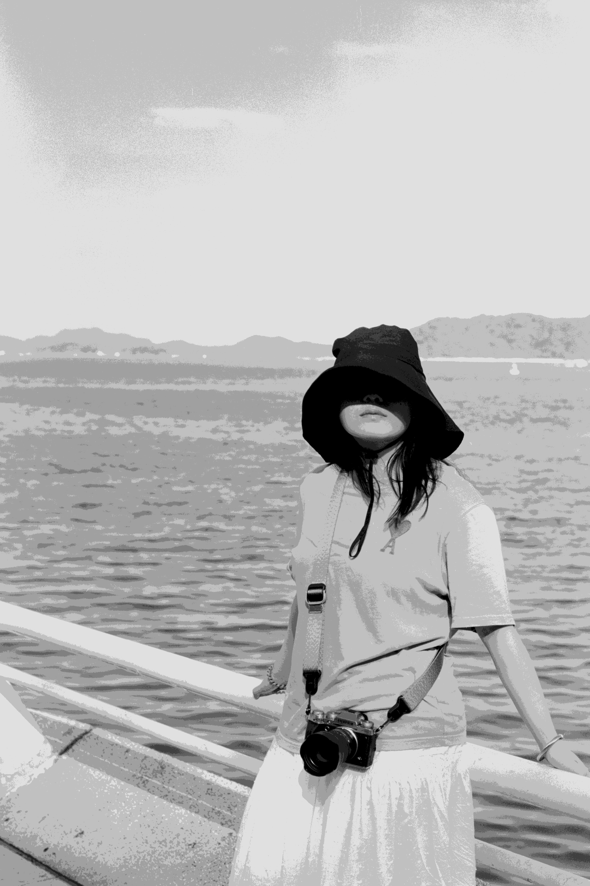
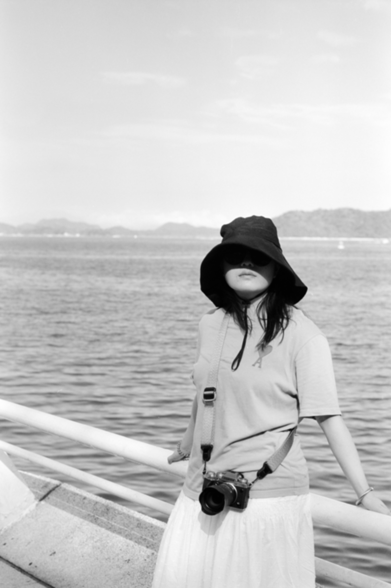
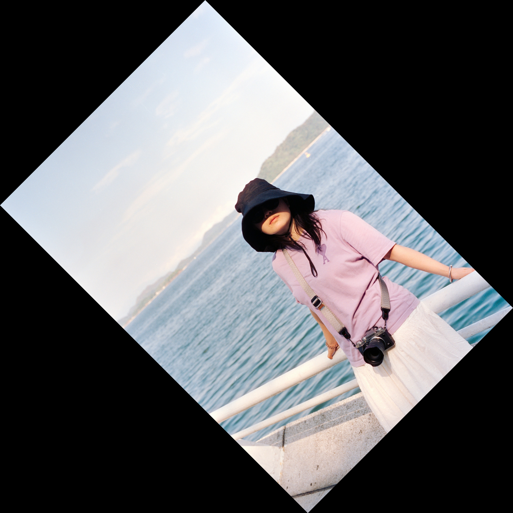

# EC7212 - Computer Vision and Image Processing: Take Home Assignment 1

**GitHub Repository**: [https://github.com/Tishan-001/computer-vision-assignment-1](https://github.com/Tishan-001/computer-vision-assignment-1)

## Introduction
This report details the solutions for the Take Home Assignment 1 of the EC7212 Computer Vision and Image Processing course. The assignment comprises four image processing tasks implemented in Python using OpenCV and NumPy. The tasks are:
1. Reducing intensity levels to powers of 2.
2. Performing spatial averaging with 3x3, 10x10, and 20x20 kernels.
3. Rotating an image by 45 and 90 degrees.
4. Reducing spatial resolution using 3x3, 5x5, and 7x7 blocks.

The code is available in the GitHub repository linked above, along with the input and output images.

## Task 1: Reducing Intensity Levels
### Description
This task reduces the intensity levels of a grayscale image from 256 to a variable number of levels (powers of 2, e.g., 2, 4, 8).

### Implementation
The function `reduce_intensity_levels` converts the image to grayscale and quantizes pixel values using the formula: `(image // factor) * factor`, where `factor = 256 // levels`. It ensures the input levels are valid powers of 2.

### Results
The input image and outputs for 2, 4, and 8 levels are generated as:
- `input_image.jpg`
- `reduced_intensity_2_levels.jpg`
- `reduced_intensity_4_levels.jpg`
- `reduced_intensity_8_levels.jpg`

## Task 2: Spatial Averaging
### Description
This task applies a spatial averaging filter using 3x3, 10x10, and 20x20 kernels to smooth the image.

### Implementation
The function `spatial_average` uses OpenCV's `filter2D` with a normalized box kernel (ones divided by kernel size squared). The image is converted to grayscale before processing.

### Results
The outputs show increasing smoothness with larger kernels:
- `spatial_average_3x3.jpg`
- `spatial_average_10x10.jpg`
- `spatial_average_20x20.jpg`

## Task 3: Image Rotation
### Description
This task rotates the image by 45 and 90 degrees without cropping.

### Implementation
The function `rotate_image` computes a rotation matrix using OpenCV's `getRotationMatrix2D` and adjusts the output dimensions to prevent cropping. The transformation is applied using `warpAffine`.

### Results
The rotated images are:
- `rotated_45_degrees.jpg`
- `rotated_90_degrees.jpg`

## Task 4: Reducing Spatial Resolution
### Description
This task reduces spatial resolution by replacing non-overlapping blocks (3x3, 5x5, 7x7) with their average values.

### Implementation
The function `reduce_spatial_resolution` iterates over non-overlapping blocks, computes the mean, and assigns it to all pixels in the block.

### Results
The outputs show reduced spatial detail:
- `reduced_resolution_3x3.jpg`
- `reduced_resolution_5x5.jpg`
- `reduced_resolution_7x7.jpg`

## Conclusion
The assignment was completed using Python with OpenCV and NumPy, producing the expected outputs for all tasks. The code is modular and robust, handling errors appropriately. The GitHub repository contains the code and images: [https://github.com/Tishan-001/computer-vision-assignment-1](https://github.com/Tishan-001/computer-vision-assignment-1) .